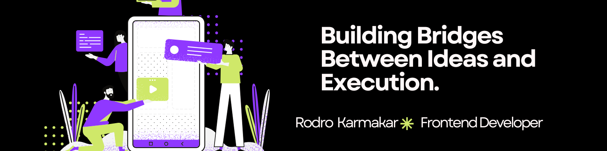

   

### Hi there👋  
  

I am Rodro karmakar, a frontend developer who is trying to learn something every day and constantly learning and exploring new technologies to sharpen my skills. My goal is to create seamless user experiences and delightful interactions. I'm obsessed with optimizing performance and code elegance  
  

- 🌱 Currently delving deeper into something cool and passionate about creating seamless animations.  
  

- 💡 Always exploring new technologies to stay ahead.  
  

- ⚡Fun Fact: I get peace by solving problems  

- Portfolio here: https://rodro.vercel.app/
  

  

   

## 👨‍💻 Skills & Experience:

      
 
 

 

<table border="0">
    
  <tr>

<td>
        
     </td>
  </tr>
</table>

 
 
Connect with me:
 
 

  
 
## 📩 For Business Inquiries:
 

